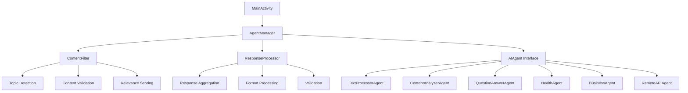

# Android AI Agent - Development & Deployment Guide

## Quick Start Development

### Prerequisites
- **Android Studio**: Arctic Fox (2020.3.1) or later
- **Android SDK**: API level 24 (Android 7.0) or higher
- **Kotlin**: 1.9.0+
- **Gradle**: 8.1.0+

### Build Instructions

1. **Clone and Build**:
```bash
git clone https://github.com/SharksJio/AIAgent.git
cd AIAgent
./gradlew assembleDebug
```

2. **Run Tests**:
```bash
./gradlew test           # Unit tests
./gradlew connectedAndroidTest  # Instrumented tests
```

3. **Install on Device**:
```bash
./gradlew installDebug
```

## Architecture Deep Dive

### Core System Design



### Data Flow

1. **Input Processing**: User input → Topic detection → Content filtering
2. **Agent Selection**: Topic-based agent filtering → Priority sorting
3. **Request Processing**: Single/Multiple agent processing → Response generation
4. **Output Processing**: Response aggregation → Formatting → Display

## Custom Agent Development

### Step-by-Step Agent Creation

1. **Define Agent Configuration**:
```kotlin
val myAgentConfig = AgentConfig(
    id = "my_custom_agent_001",
    name = "My Custom AI Agent",
    type = AgentType.CUSTOM,
    supportedTopics = setOf(TopicCategory.TECHNOLOGY, TopicCategory.SCIENCE),
    priority = 8,
    isEnabled = true,
    endpoint = "https://api.myservice.com/v1/process",
    apiKey = "your_secure_api_key",
    customProperties = mapOf(
        "model" to "gpt-4",
        "temperature" to 0.7,
        "maxTokens" to 1000
    )
)
```

2. **Implement Agent Class**:
```kotlin
class MyCustomAgent : BaseAIAgent(myAgentConfig) {
    
    private val httpClient = OkHttpClient.Builder()
        .connectTimeout(30, TimeUnit.SECONDS)
        .readTimeout(60, TimeUnit.SECONDS)
        .build()
    
    override suspend fun processRequest(request: AgentRequest): AgentResponse {
        val startTime = System.currentTimeMillis()
        
        try {
            // Pre-process the request
            val processedContent = preprocessContent(request.content)
            
            // Make API call
            val apiResponse = callExternalAPI(processedContent, request.topic)
            
            // Post-process the response
            val finalContent = postprocessResponse(apiResponse)
            
            return createResponse(
                requestId = request.id,
                content = finalContent,
                confidence = calculateConfidence(apiResponse),
                topic = request.topic,
                startTime = startTime
            )
            
        } catch (e: Exception) {
            return createErrorResponse(request.id, "Processing failed: ${e.message}")
        }
    }
    
    private suspend fun callExternalAPI(content: String, topic: TopicCategory): String {
        val requestBody = buildAPIRequestBody(content, topic)
        
        val request = Request.Builder()
            .url(config.endpoint ?: throw IllegalStateException("No endpoint configured"))
            .addHeader("Authorization", "Bearer ${config.apiKey}")
            .addHeader("Content-Type", "application/json")
            .post(requestBody)
            .build()
        
        return withContext(Dispatchers.IO) {
            val response = httpClient.newCall(request).execute()
            if (response.isSuccessful) {
                response.body?.string() ?: ""
            } else {
                throw IOException("API call failed: ${response.code}")
            }
        }
    }
    
    private fun preprocessContent(content: String): String {
        // Add any preprocessing logic (cleaning, normalization, etc.)
        return content.trim()
    }
    
    private fun postprocessResponse(apiResponse: String): String {
        // Add any postprocessing logic (formatting, validation, etc.)
        return apiResponse
    }
    
    private fun calculateConfidence(apiResponse: String): Double {
        // Implement confidence calculation based on response quality
        return if (apiResponse.isNotBlank()) 0.85 else 0.1
    }
    
    private fun createErrorResponse(requestId: String, errorMessage: String): AgentResponse {
        return AgentResponse(
            id = requestId,
            agentId = config.id,
            content = "Error: $errorMessage",
            confidence = 0.0,
            topic = TopicCategory.GENERAL,
            processingTime = 0L,
            metadata = mapOf("error" to true, "errorMessage" to errorMessage)
        )
    }
    
    private fun buildAPIRequestBody(content: String, topic: TopicCategory): RequestBody {
        val json = JSONObject().apply {
            put("content", content)
            put("topic", topic.name)
            put("model", config.customProperties["model"])
            put("temperature", config.customProperties["temperature"])
            put("max_tokens", config.customProperties["maxTokens"])
        }
        
        return json.toString().toRequestBody("application/json".toMediaType())
    }
}
```

3. **Register the Agent**:
```kotlin
// In MainActivity or Application class
val customAgent = MyCustomAgent()
agentManager.registerAgent(customAgent)
```

## External Service Integration

### OpenAI Integration Example
```kotlin
class OpenAIAgent : BaseAIAgent(openAIConfig) {
    
    override suspend fun processRequest(request: AgentRequest): AgentResponse {
        val startTime = System.currentTimeMillis()
        
        val openAIRequest = JSONObject().apply {
            put("model", "gpt-3.5-turbo")
            put("messages", JSONArray().apply {
                put(JSONObject().apply {
                    put("role", "user")
                    put("content", request.content)
                })
            })
            put("max_tokens", 500)
            put("temperature", 0.7)
        }
        
        val response = makeOpenAICall(openAIRequest)
        val content = extractContentFromResponse(response)
        
        return createResponse(
            requestId = request.id,
            content = content,
            confidence = 0.9,
            topic = request.topic,
            startTime = startTime
        )
    }
    
    private suspend fun makeOpenAICall(requestBody: JSONObject): String {
        // Implementation for OpenAI API call
        // Handle authentication, request/response processing, etc.
    }
}
```

### Google Cloud AI Integration
```kotlin
class GoogleCloudAIAgent : BaseAIAgent(gcpConfig) {
    
    override suspend fun processRequest(request: AgentRequest): AgentResponse {
        val startTime = System.currentTimeMillis()
        
        val gcpRequest = buildGCPRequest(request)
        val response = callGCPAPI(gcpRequest)
        val processedContent = parseGCPResponse(response)
        
        return createResponse(
            requestId = request.id,
            content = processedContent,
            confidence = extractConfidenceFromGCP(response),
            topic = request.topic,
            startTime = startTime
        )
    }
    
    private fun buildGCPRequest(request: AgentRequest): JSONObject {
        // Build GCP AI Platform request
    }
    
    private suspend fun callGCPAPI(request: JSONObject): String {
        // Implement GCP API call with proper authentication
    }
}
```

## Performance Optimization

### Caching Implementation
```kotlin
class CachedAgent(private val baseAgent: AIAgent) : AIAgent by baseAgent {
    
    private val cache = LruCache<String, AgentResponse>(100)
    
    override suspend fun processRequest(request: AgentRequest): AgentResponse {
        val cacheKey = "${request.content.hashCode()}_${request.topic}"
        
        cache.get(cacheKey)?.let { cachedResponse ->
            return cachedResponse.copy(
                id = request.id,
                metadata = cachedResponse.metadata + ("cached" to true)
            )
        }
        
        val response = baseAgent.processRequest(request)
        cache.put(cacheKey, response)
        return response
    }
}
```

### Connection Pooling
```kotlin
object NetworkManager {
    val httpClient = OkHttpClient.Builder()
        .connectionPool(ConnectionPool(5, 5, TimeUnit.MINUTES))
        .connectTimeout(30, TimeUnit.SECONDS)
        .readTimeout(60, TimeUnit.SECONDS)
        .writeTimeout(60, TimeUnit.SECONDS)
        .addInterceptor(loggingInterceptor)
        .addInterceptor(retryInterceptor)
        .build()
}
```

## Security Best Practices

### API Key Management
```kotlin
// Use Android's encrypted shared preferences
class SecureConfigManager(context: Context) {
    
    private val encryptedPrefs = EncryptedSharedPreferences.create(
        "secure_agent_config",
        "master_key",
        context,
        EncryptedSharedPreferences.PrefKeyEncryptionScheme.AES256_SIV,
        EncryptedSharedPreferences.PrefValueEncryptionScheme.AES256_GCM
    )
    
    fun storeAPIKey(agentId: String, apiKey: String) {
        encryptedPrefs.edit().putString("${agentId}_api_key", apiKey).apply()
    }
    
    fun getAPIKey(agentId: String): String? {
        return encryptedPrefs.getString("${agentId}_api_key", null)
    }
}
```

### Input Validation
```kotlin
class SecurityValidator {
    
    private val maxContentLength = 10000
    private val bannedPatterns = listOf(
        Regex("<script.*?>.*?</script>", RegexOption.IGNORE_CASE),
        Regex("javascript:", RegexOption.IGNORE_CASE),
        Regex("data:text/html", RegexOption.IGNORE_CASE)
    )
    
    fun validateInput(content: String): ValidationResult {
        return when {
            content.length > maxContentLength -> 
                ValidationResult.Invalid("Content too long")
            bannedPatterns.any { it.containsMatchIn(content) } -> 
                ValidationResult.Invalid("Potentially malicious content")
            else -> ValidationResult.Valid
        }
    }
}
```

## Monitoring and Analytics

### Performance Metrics
```kotlin
class AgentMetrics {
    
    private val responseTimesMap = mutableMapOf<String, MutableList<Long>>()
    private val confidenceScoresMap = mutableMapOf<String, MutableList<Double>>()
    private val errorCountsMap = mutableMapOf<String, Int>()
    
    fun recordResponse(agentId: String, response: AgentResponse) {
        responseTimesMap.getOrPut(agentId) { mutableListOf() }.add(response.processingTime)
        confidenceScoresMap.getOrPut(agentId) { mutableListOf() }.add(response.confidence)
        
        if (response.metadata.containsKey("error")) {
            errorCountsMap[agentId] = errorCountsMap.getOrDefault(agentId, 0) + 1
        }
    }
    
    fun getMetricsReport(): String {
        return buildString {
            appendLine("=== Agent Performance Report ===")
            responseTimesMap.forEach { (agentId, times) ->
                val avgTime = times.average()
                val maxTime = times.maxOrNull() ?: 0
                val minTime = times.minOrNull() ?: 0
                
                appendLine("Agent: $agentId")
                appendLine("  Avg Response Time: ${avgTime.toInt()}ms")
                appendLine("  Min/Max Time: ${minTime}ms / ${maxTime}ms")
                appendLine("  Total Requests: ${times.size}")
                appendLine("  Error Count: ${errorCountsMap.getOrDefault(agentId, 0)}")
                appendLine()
            }
        }
    }
}
```

## Deployment Guide

### Release Build
```bash
# Create release APK
./gradlew assembleRelease

# Create Android App Bundle (recommended for Play Store)
./gradlew bundleRelease
```

### Proguard Configuration
Add to `app/proguard-rules.pro`:
```proguard
# Keep AI Agent classes
-keep class com.sharksjio.aiagent.** { *; }

# Keep agent configurations
-keepclassmembers class com.sharksjio.aiagent.core.AgentConfig {
    <fields>;
}

# Keep network models for JSON serialization
-keepclassmembers class * {
    @com.google.gson.annotations.SerializedName <fields>;
}
```

### Testing Strategy

1. **Unit Tests**: Core logic testing
2. **Integration Tests**: Agent interactions
3. **UI Tests**: User interface validation
4. **Performance Tests**: Response time validation
5. **Security Tests**: Input validation and sanitization

## Troubleshooting Guide

### Common Issues

**Agent Not Responding**:
- Check network connectivity
- Verify API credentials
- Review endpoint configurations
- Check rate limiting

**Poor Response Quality**:
- Review agent training data
- Adjust confidence thresholds
- Improve content preprocessing
- Update topic detection keywords

**Performance Issues**:
- Implement response caching
- Optimize API calls
- Use connection pooling
- Monitor memory usage

**Security Concerns**:
- Validate all inputs
- Use encrypted storage for credentials
- Implement proper authentication
- Monitor for suspicious activity

This comprehensive guide provides everything needed to develop, customize, and deploy the Android AI Agent system successfully.